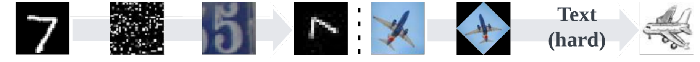

# Surprise-Stream

In  General Continual Learning (GCL), the goal is to learn a sequence of tasks that are presented once while maintaining performance on all previously learned tasks without the task identity during both the training and the evaluation phase. Stream provides a method to construct an infinite long sequence of tasks with varying degree of domain-gap (`learning-gap`) from a limited set of multi-modal dataset.

For example, one can use SVHN and MNIST (`snum`) to construct a sequence of tasks with different degree of `learning-gaps`.

<p style="text-align:center">

</p>

## Usage

### Overview

1. Install
   We recommend using a virtual enviroment with Python>3.10
   ```bash
   git clone https://github.com/fostiropoulos/stream.git
   cd stream
   pip install  .
    ```
2. [Download the pre-processed dataset](https://drive.google.com/file/d/1EYXOo4xEXSLwl2bim4BE9EiR4Km4HOkQ/view?usp=sharing)

3. Modify [Example](examples/run_benchmark.py) to apply a GCL to avoid catastrophic forgetting


### In Detail:

1. After you download the dataset extract it to your desired location. The directory should have a structure like:

```bash
surprise_feats
    - amazon
        - feats
        . metadata.pickle
    - domainnetreal
    - domainnetsketch
    - imdb
```

2. You can run the dummy learner from the example by running the following command from the terminal
```
python examples/run_benchmark.py --dataset_name pmnist --dataset_path [save_directory]
```

3. In the example a dummy learner is provided by default as the `backbone` the goal is to make the `dummy_learner` not forget. Forgeting is evaluated as the auc score on all tasks learned so far. You can adapt the example to evaluate an existing method or design your own.

```python
# TODO make me (backbone) not forget
dummy_learner: Backbone = make_backbone(**config)
```
**NOTE** For a Generalized Continual Learning (GCL) setting:
1. The train tasks must appear once
2. You should not use information on the transitions between tasks (e.g. when a task ends and another begins) or their identity during both training and evaluation.
3. There should be a restriction on the resources when a new task arrives. Since the setting is for an infinite stream of tasks, it is trivial to create a copy of the same model to avoid forgetting or store all data as they come in. However the method should be designed such that it does not require an infinite amount of resources.


# Datasets


```python
from stream import TaskScheduler
# You can set the dataset to be, ["snum", "pmnist", "snumv", "svis", "splitcifar", "smodal"]
surprise_stream = TaskScheduler(
        dataset="snumv", dataset_root_path=dataset_path, batch_size=128
    )
```

## Supported Task-Sequences

### ResNetModel

Datasets in this section have their features extracted from a the first layer of ConvLayer of a pretrained ResNet-18 where each sample is `64x16x16` (CxWxH) dimensions.

They can be used with `stream.modules.backbone.ResNetModel`

Datasets:

1. S-Num (`snum`): A task-sequence constructed from [MNIST](https://pytorch.org/vision/main/generated/torchvision.datasets.MNIST.html) and [SVHN](https://pytorch.org/vision/main/generated/torchvision.datasets.SVHN.html#torchvision.datasets.SVHN) as `base datasets`, $D_\text{base}$, where the each class corresponds to a one-to-one mapping between the classes of the two dataset.


2. S-Vis (`svis`): A task-sequence constructed from [CIFAR10](https://pytorch.org/vision/main/generated/torchvision.datasets.CIFAR10.html#torchvision.datasets.CIFAR10) and [CINIC10](https://github.com/BayesWatch/cinic-10) (a mapping of ImageNet to CIFAR10 classes) as `base datasets`, $D_\text{base}$, where the each class corresponds to a one-to-one mapping between the classes of the two dataset.

3. SplitCIFAR100 (`splitcifar`): A task-sequence constructed by splitting the classes of [CIFAR100](https://pytorch.org/vision/main/generated/torchvision.datasets.CIFAR100.html#torchvision.datasets.CIFAR100) $D_\text{base}$ to 10 tasks where there is no one-to-one mapping between the classes of each task.


### ResMLP

Samples in the task-sequences from this section are vectors where each sample is 768 dimensions.

They can be used with `stream.modules.backbone.ResMLP`

1. S-Num - Vector (`snumv`): A vectorized version of `snum` task-sequence where SVHN is resized to 28x28, converted to grayscale and flatten to 768-D.


2. S-Modal (`smodal`): A multi-modal task-sequence constructed using two Vision (Real, Sketch from [DomainNet](http://ai.bu.edu/M3SDA/)) and two Text ([IMDB](https://ai.stanford.edu/~amaas/data/sentiment/), [Amazon](https://huggingface.co/datasets/amazon_us_reviews)) datasets, $D_\text{base}$. S-Modal does not have a 1-to-1 mapping between the classes of the datasets. We map the 345 DomainNet classes into 10 concepts by performing clustering on the feature vectors from the textual descriptions of each class extracted using a [CLIP](https://huggingface.co/docs/transformers/model_doc/clip) model. It is an efficient method to evaluate a learning algorithm under `concept-learning`. The classes for the remaining datasets are unaffected. For the dataset we extract the feature vectors using a pre-trained [ViT](https://huggingface.co/docs/transformers/model_doc/vit) for Vision and [GPT-2](https://huggingface.co/gpt2) for Text and embed to a common 768-D feature space.


3. Permuted Mnist (`pmnist`):  A task-sequence constructed by randomly permuting the images of MNIST as $D_\text{base}$ and providing a feature vector of 768-D.