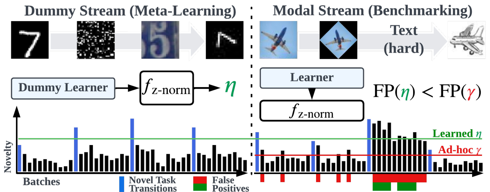

<h1 style="text-align:center"> Stream: A Generalized Continual Learning Benchmark and Baseline </h1>

<h3 style="text-align:center"> Iordanis Fostiropoulos &nbsp;&nbsp;&nbsp; Jiaye Zhu &nbsp;&nbsp;&nbsp; Laurent Itti</h3>

 University of Southern California

<!-- <a href="">[arXiv]</a>
&nbsp;&nbsp;&nbsp;
<a href="https://github.com/fostiropoulos/stream">[Code]</a>
&nbsp;&nbsp;&nbsp;
<a href="https://github.com/fostiropoulos/stream">[Data]</a> -->

## Overview

In  General Continual Learning (GCL), the goal is to learn a sequence of tasks that are presented once while maintaining performance on all previously learned tasks without the task identity during both the training and evaluation phase. Stream provides a method to project and construct an infinite long sequence of tasks with varying degree of domain-gap (`learning-gap`) from a limited set of multi-modal dataset.

The release of this Dataset and instructions are for the purposes of reviewing for [NeurIPS 2023 Datasets and Benchmarks Track](https://nips.cc/Conferences/2023/CallForDatasetsBenchmarks)

For Detailed instructions please see our <a href="https://github.com/fostiropoulos/surprise-stream">[Code]</a>.

## Intuition

Illustration of our Stream benchmark and a threshold-based approach in identifying novelty. **Left**: our meta-learning process uses a `dummy` learner that does not attempt to mitigate
forgetting. It is exposed to a stream of heterogeneous tasks (with different `learning-gaps`), just
like the actual learner. By monitoring transitions to novel tasks (blue bars) over time, the dummy
learner, in its simplest form, just adjusts a dynamic novelty threshold η (green) to maximize future
novelty prediction. **Right**: compared to the previously used static ad-hoc threshold γ (red), our
meta-learning process improves the false positive rate (i.e. area under the novelty bars). Yet, using a
threshold can still fail for difficult tasks (e.g. `Text`) where difficult samples are hard to distinguish
from novelty.